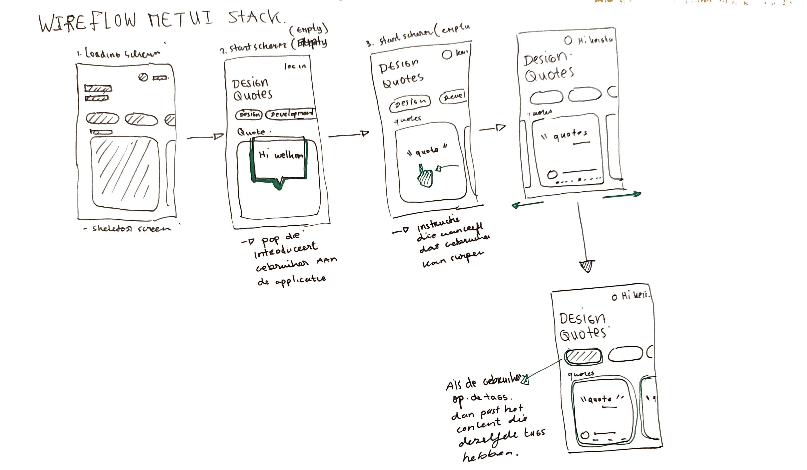
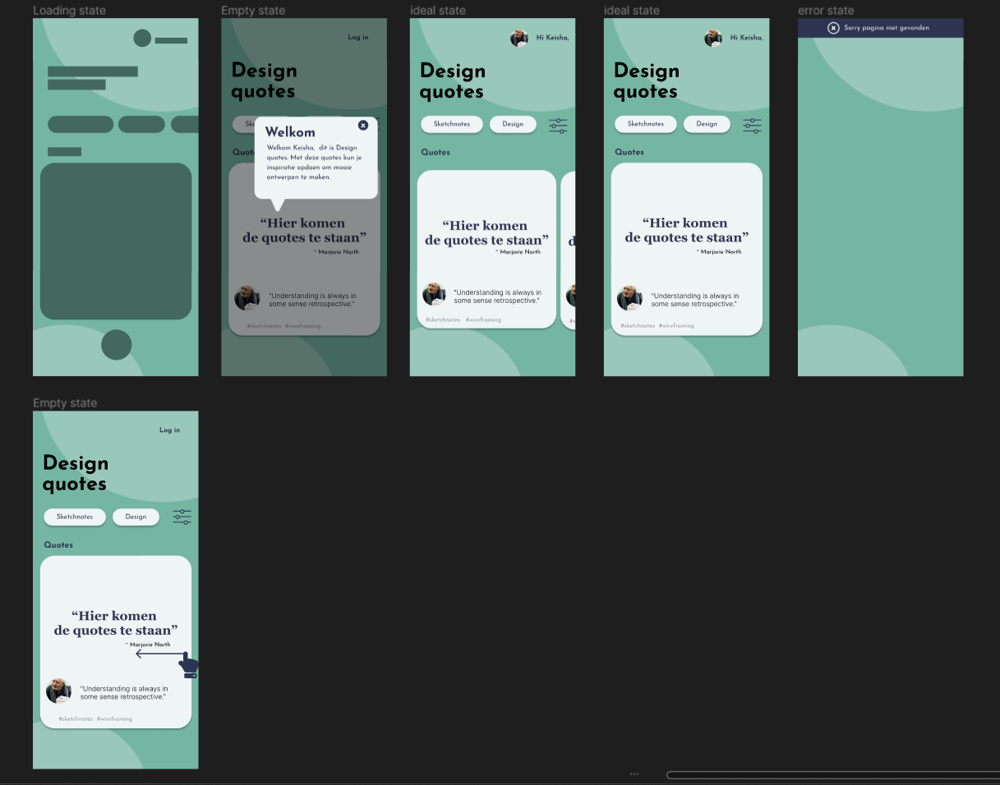
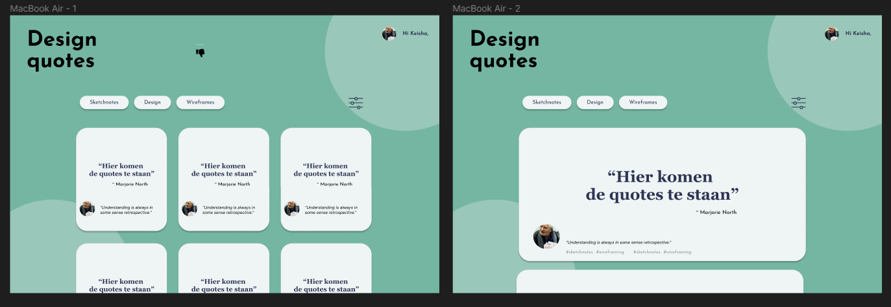
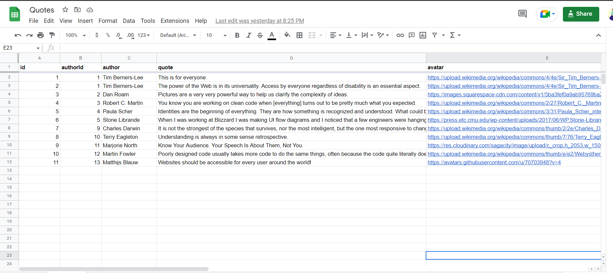
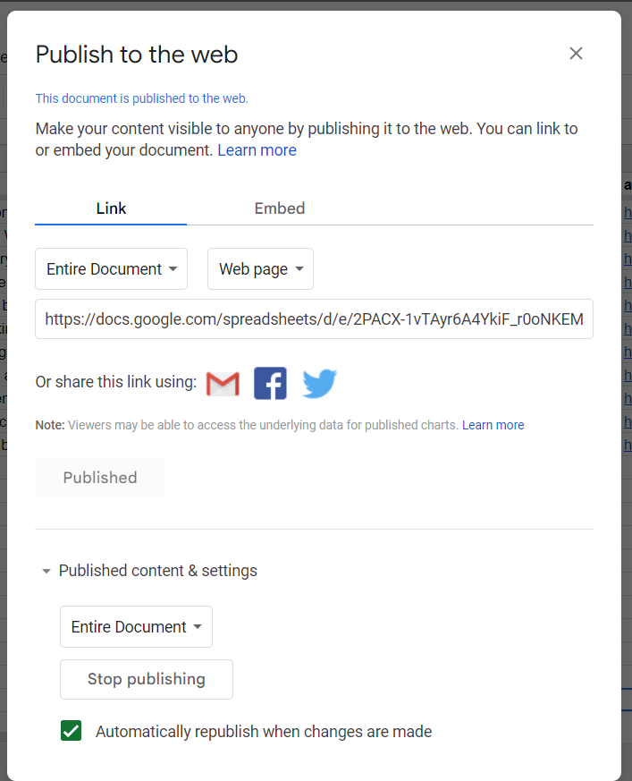

# Design quotes app
 
 ### Belangrijk links

- [Link naar visitekaart](https://k3a101.github.io/stress-relief-quotes/visitekaartje/)
- [Link naar Single page web app](https://k3a101.github.io/stress-relief-quotes/spa/)


 ---

## De opdracht 
Voor de opdracht heb ik een single page gemaakt op basis van een user story. De single page is gemaakt met vanilla HTML, CSS en javascript. 


## User story
> Als student digital design, wil ik inspirerende web design quotes kunnen bekijken, zodat ik weer een beetje energie krijg wanneer ik het even niet meer zie zitten met al die hard-core deadlines die op me afkomen.


## Idee 
Mijn idee is een quote app voor studenten die opzoek naar inspiratie voor hun projecten. De app heet Design quotes. In design quotes kun je aanmelden en krijg je een lijst met inspirerende quotes van experts in het gebied van design en de web. De quotes worden constant up to date dus elke dag komen meer quotes erbij. Elk citaat bevat een tag die je kan filtreren op basis van design onderwerpen. 



## Design
Hieronder staat het design van de design quotes app. Hier bij had ik ook nagedacht aan de UI stactk die darbij horen zoals de empty state, loading state en de error state.  



Verder heb ik ook een design bedacht voor groter schermen. Hier verandert alleen de layout. Hier ga je vertical scrollen.



--- 

# API
# Inleiding

De quotes api ging stuk  en ik moest een nieuwe api toevoegen in mijn webappliatie. IK heb gekozen om zelf een api te maken met behulp van google sheets. De google sheet werk als een  backend database. 

## Hoe maak je een eigen Api

Voor mijn project heb ik zelf een api gemaakt met behulp van google sheet en de APi van [Ben Borgers](https://github.com/benborgers/opensheet#readme). Om de spreadsheets een json bestand te maken heb ik een aantal stappen doorgenomen. 

### Stappen

- Data invullen in google sheets
    
   
    
- De header is vetgedrukt en die is de objectnaam. Ik heb ook de eerste row gevriesd want anders krijg foutmelding
- Verder heb ik mijn spreadsheats gepubliceerd op de web
    
    
    
- De sharing link heb ik iedereen als viewer gegeven. Ik ben de enige met toegang naar het spreadsheet.
- Ik heb de api link van Ben Borgers gebruikt. 
  
   ```
    https://opensheet.elk.sh/spreadsheet_id/tab_name

   ```

- Ik heb  mij spreadsheet code/id and sheet naam aan de link toegevoegd:
```
 https://opensheet.elk.sh/14joQ9h8M0ydoJJ-fNYN68ls3TWPCvk8ZvBJvUXpF1cQ/sheet1
 ```
- De code kun je vinden bij de url van de spreadsheet bestand.

  
Als je deze stappen uitvoert heb je een json bestand met een APi url die je kan fetchen. Een voordeel is dat je data in de spreadsheet  kan toevoegen en wordt de json bestand automatisch aangepast. 

---

### Bronnen
- https://github.com/benborgers/opensheet#readme
- https://benborgers.com/posts/google-sheets-json