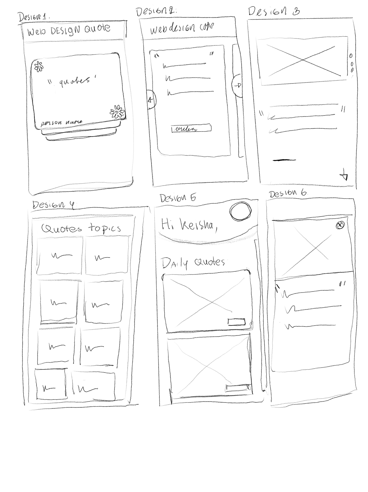
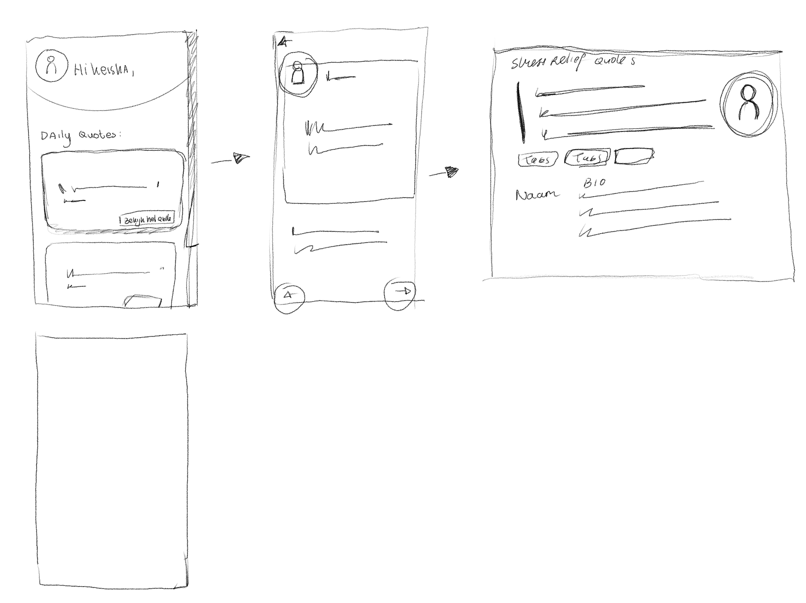
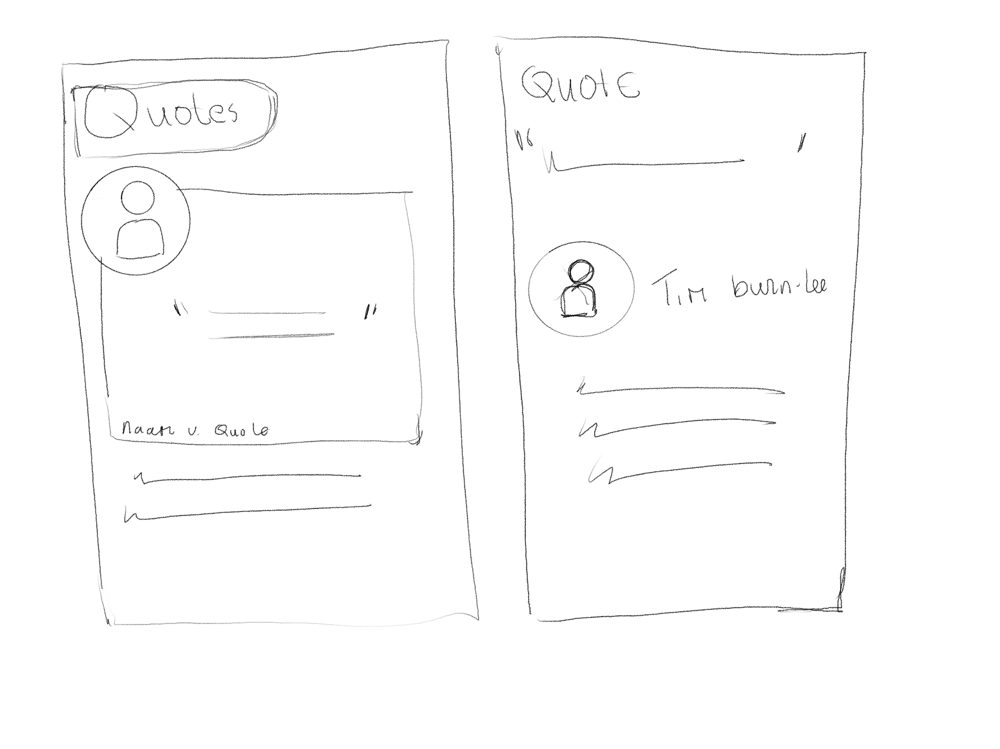
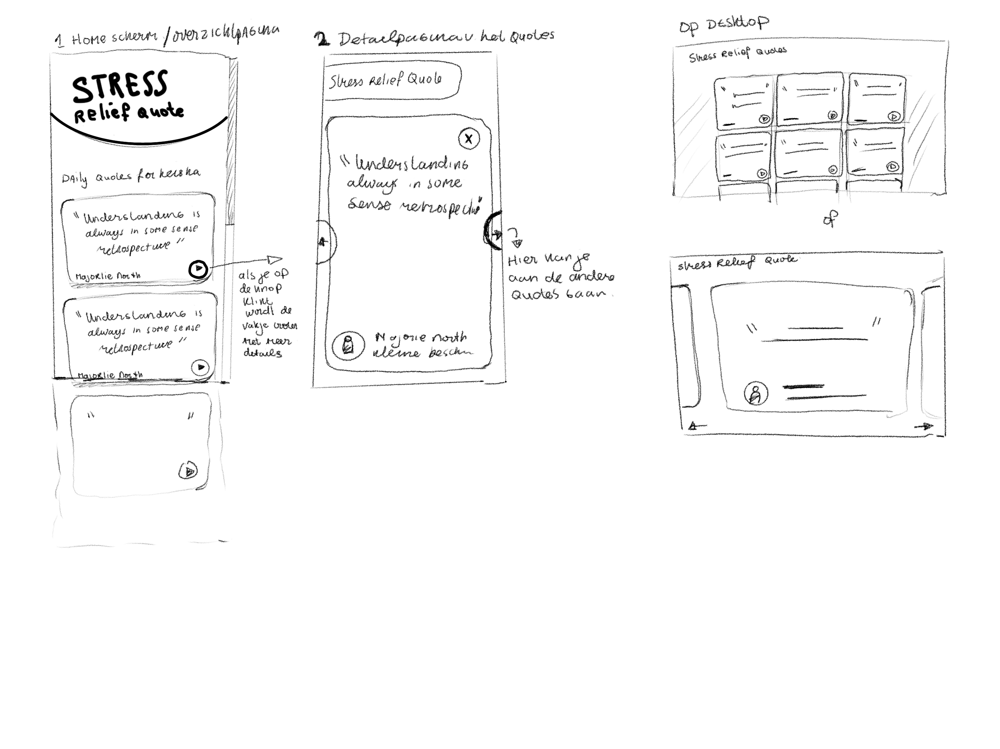
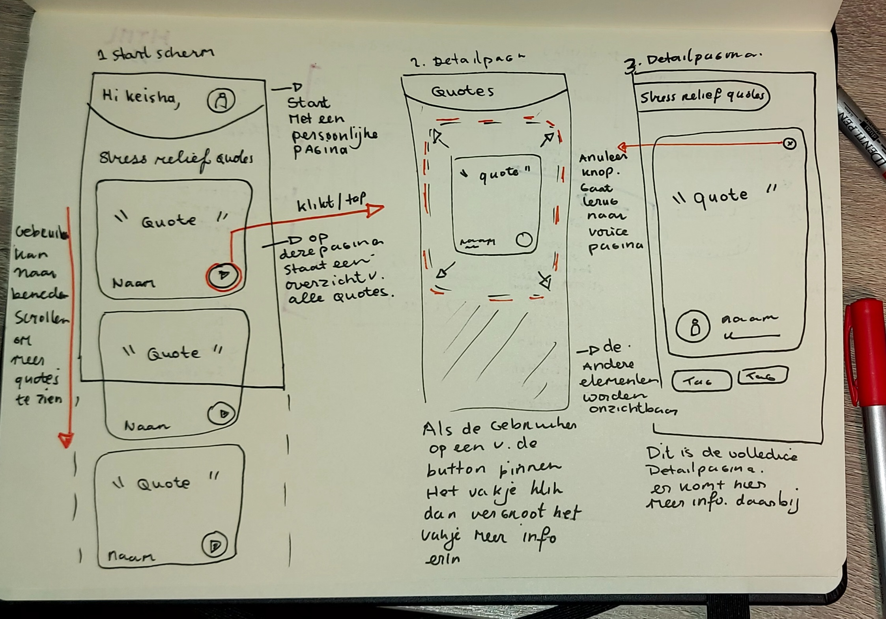
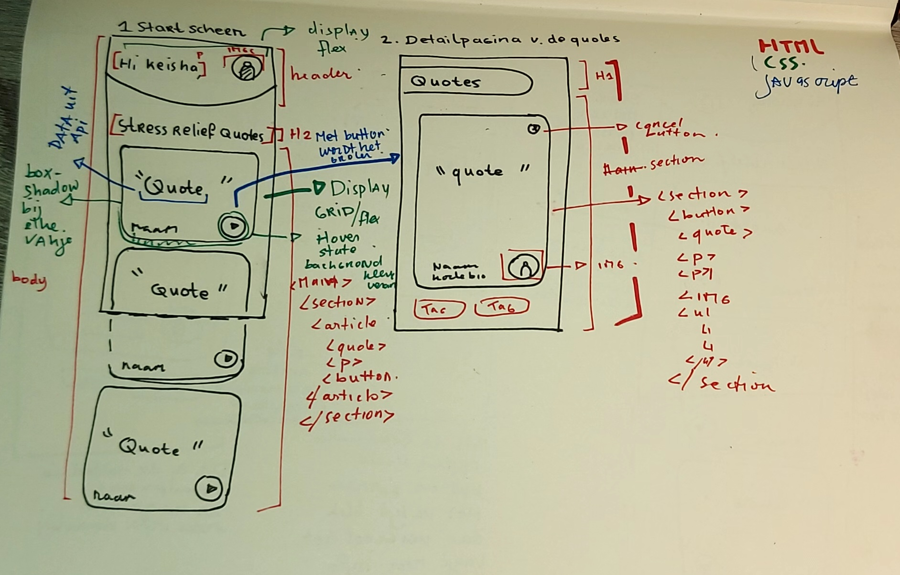
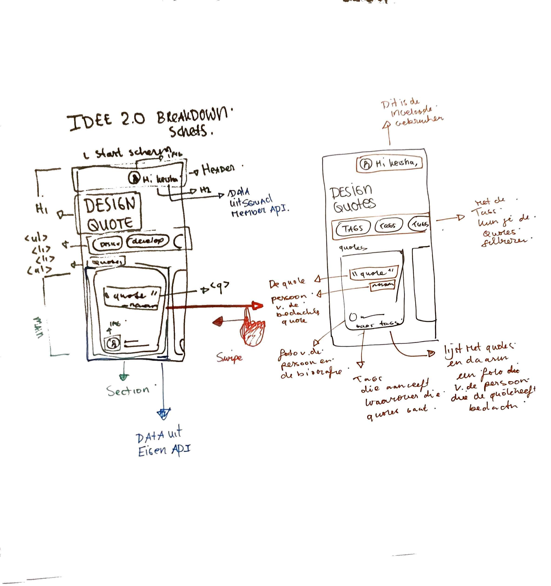
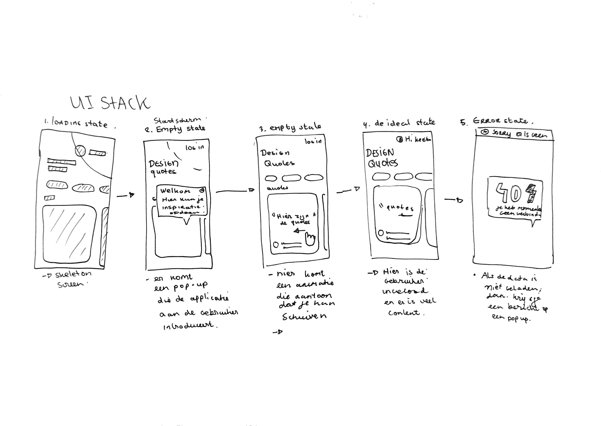

# Design quotes 
 

## User story
> Als student digital design, wil ik inspirerende web design quotes kunnen bekijken, zodat ik weer een beetje energie krijg wanneer ik het even niet meer zie zitten met al die hard-core deadlines die op me afkomen.

## Idee 
Ik ga een single web app maken waar studenten verschillende quotes kan bekijken om hun deadlines te doormaken. De quotes zijn van verschillende designers die ook in de industrie werkte.

#### Schets 1
Hier had ik verschillende schetsen gemaakt voor een mogelijke prototypes. Ze zijn allerlei manieren hoe ik de quotes kan laten weergeven. Mijn voorkeureen waren design 2 en Design 5. Ik ga ze samen combineren tot een geheel. 

#### Schets 2
Bij deze schets heb ik andere type layout geprobeerd, die ik kan gebruiken bij de desktop. De quotes is een belangrijke element op de pagina dus die moet groter op de pagina verschijnen. 

#### Schets 3
Bij schets 3 probeer ik verschillende layout voor de detailpagina van de quote. In deze pagina staat de meer informatie van de quotes, namelijk de foto van het persoon die de quotes had bedacht en  een korte biografie van die persoon. Dit wilde ik ook toevoegen in mijn prototype.

#### Schets 4

In mijn idee heb ik twee paginas uitgewerkt. Op de startpagina heb je een overzicht van all quotes uit de API. In elke vakjes sataan de quote zelf en de uitvinder van de quotes. Als je op de knop klikt vergroot de vakje en komt meer informatie bij. Zolas de foto van de uitvinder, en de biografie van de quotes. 

Het ontwerp is responsive, ik ga eerst op mobiel werken en daarna ga ik voor desktop werken. Op desktop werkt het allemaal hetzelfde, alleen heb je meer ruimte voor alle onderdelen.

---

## Wireflow

Dit is min wireflow voor me eerste idee.

## Breakdownschets

#### Toelichting
Nadat ik mijn idee heb gekozen, heb ik een breakdown schets en een wireflow gemaakt. In de Wireflow komen de interactie van de gebruiker met de applicatie.  Bij de breakdownschets ging ik kijken naar het structuur pagina. Bijvoorbeeld welke HTML element ga ik  gebruiken en waarvoor. Welke css properties properties en hoe ik de one page interactiever kan maken.  

---

# Idee 2
## Toelichting
Ik heb heb het idee een beetje aangepast bij de layout. Hier kan de gebruiker de quotes swipen, i.p.v vertical scrollen. Dus je gaat vanuit dan je moet inloggen met je student email en heb je een persoonlijke pagina. Verder heb je de startpagina met de quotes. De quotes kun je filtreren op basis van onderwerp. 

# UI Stack

Vervolgens heb ik een schets gemaakt met de states. De states die ik heb uitgewerkt zijn, de empty state, de loading state en de error-state. Voor de loadingstate ga ik een skeleton screen maken. De stijling kan makkelijk met css. Voor de empty state ga ik wat instructie en introductie aan de gebruiker geven met behulp van een pop up.  Bij de error state, ga ik ook een pop met een foutmelding en ook een mogelijke oplossing (design principe: forgiveness). 

Bij de empty state ga ik gebruik maken van een animatie die aangeeft dat de gebruiker moet swipen om de quotes te zien. 

## Wireflow met ui Stack

