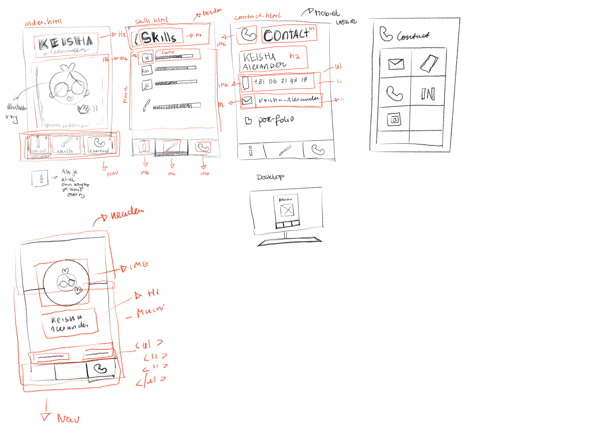
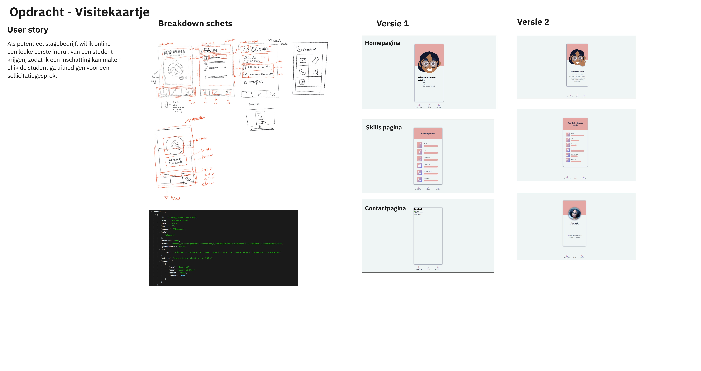

# Visitekaart - Proces

## Opdracht

In de eerste week van het vak heb ik een interactieve visitekaart gemaakt met CSS en Javascript.
Het doel van de visitekaart is om sollicitatie team mij leren kennen als potentiele staigiare.

De content heb ik de uit de API gehaald. De API is een database met alle gegevens van studenten die deze Minor doen. Mijn gegevens heb ik uitgehaald met mijn ID en kon ik aan de slag.

### Breakdownschets

